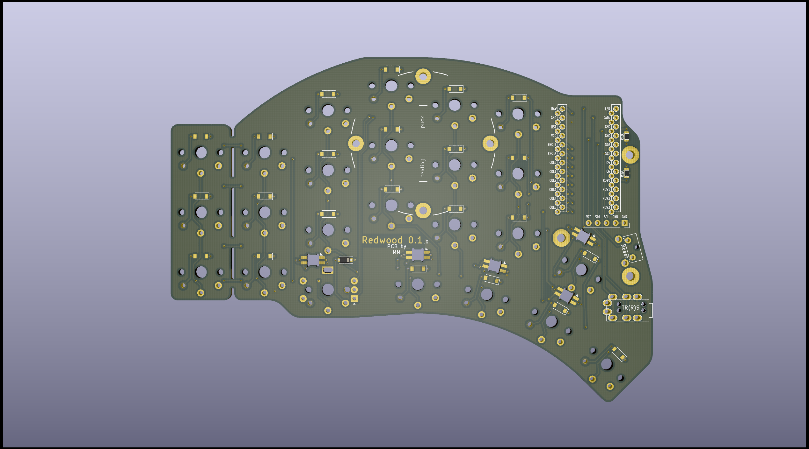
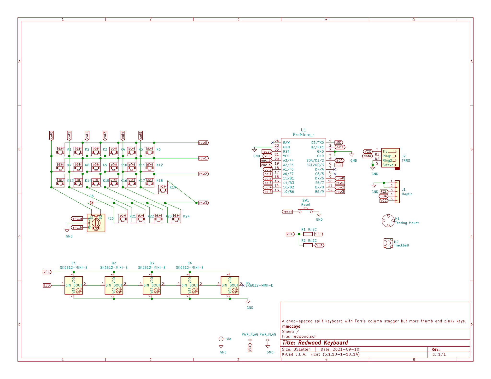
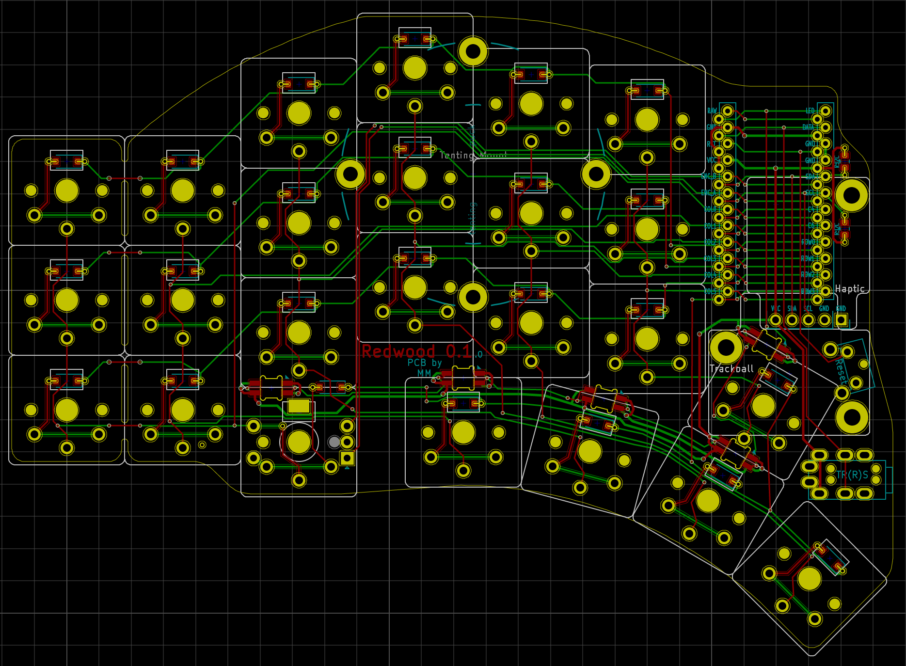

# Redwood Keyboard

Redwood is a split 3x6+6 choc-spaced board with the aggressive stagger of the Ferris but a longer thumb arc and a break-off outer pinky column, so rather like a choc Kyria, minus two keys. It uses a reversible 98 x 137mm PCB.  It isn't  minimalist at 42 to 48 keys, but is compact on finger travel while still allowing roomy keymaps.

It has encoder support under each ring finger, a header for haptic feedback, mount points for a tenting puck and hand wiring a trackball, and a little underglow from SK6812-MINI-Es. It does use SMT SOD-123 diodes and optionally two 0805 resistors.

I wanted a key or so more than the Ferris and an outer pinky option. Instead of tweaking the 3x6 choc Corne I started a new PCB for more flexibility, though it grew to fill its footprint....

## Details

* [Materials](doc/materials.md)
* [Building](doc/build.md)
* Firmware powered by [QMK](qmk.com), listed under keyboards/handwired/redwood as it not a production board, although not a handwired board.
* It is only suitable for choc v1 switches and keycaps based on an 18 x 17mm switch spacing, such as the MBK keycaps. Not MX ones.
* [Future](doc/Future.md)

# Why

I wanted an aggressive stager 3x6+3 with choc spacing and switches, so moving around the switches of the Choc Corne seemed the easiest approach. But learning more than blind KiCad modification seemed a better idea, so I started a new PCB matching the Ferris column and thumb spacing.

I liked the bottom row keys of my Atreus, so I added two under the middle columns, where they seem unobtrusive. Then one shifted to the thumb arch, which seems more versatile. An upper thumb key seemed useful and combo-able without pushing the footprint. It has more keys than my initial idea, but that makes keymap evolution feel less tight.

It is like a Ferris Sweep on steroids, which wound up close to a Choc Kyria but requiring board fabrication and SMT soldering.

## Images

