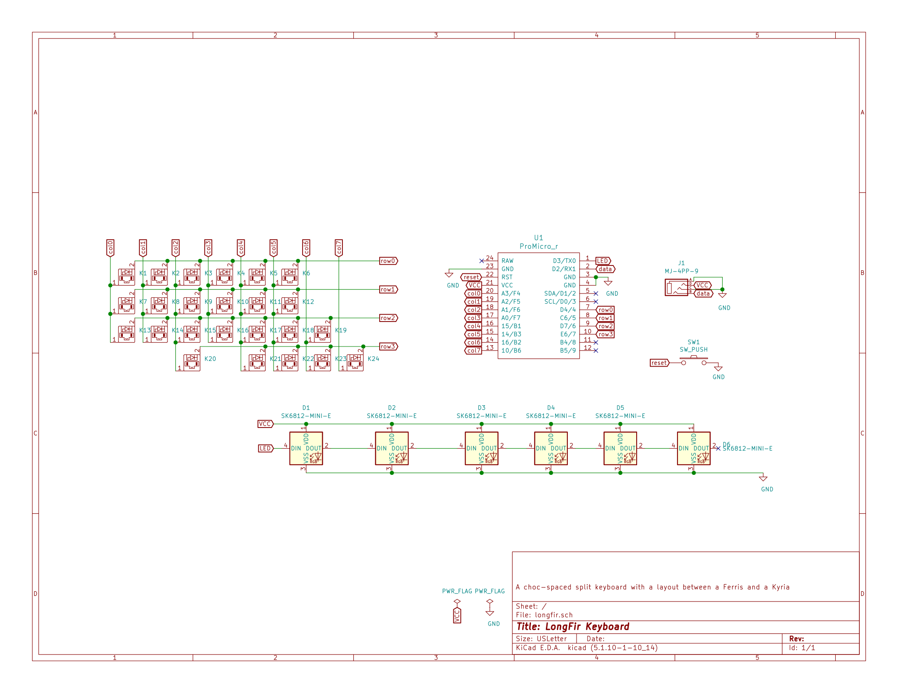

# LongFir Keyboard

This choc spaced board has the agressive stagger of the Ferris but is roomier with an expanded thumb arc and breakoff outer pinky column.
Underglow with SK6812-MINI-E provides layer feedback, and it is reversible at 100 x 141 mm.

I wanted a key or so more than the Ferris, so designed a PCB, which expanded a bit....

## Materials/guide

1. [Materials](docs/materials.md)
2. [KiCad](docs/kicad.md)

## Images

# Why

I wanted a 3x6+3 with aggressive stager and choc switches and spacing, so moving the Choc Corne switches seemed the easiest path. But learning more than blind PCB modification seemed a good idea, so I started a new PCB using the Ferris column and thumb spacing.

I liked the extra bottom row keys on my Atreus, so added two under the middle columns, where they seem unobtrusive. Though one then shifted to the thumb arch, which seems more versatile. One upper thumb key seemed useful and combo-able, while two there seemed useful but looked too bulky in something 'small'.  

Light underglow provides status, and the outer column can break off should I outgrow it. It is more keys than the minimum I wanted, but that makes the keymap evolution feel less tight.

It is like a Choc Ferris on steroids, which is very close to a Choc Kyria.

# Tradeoffs 
- The row and column matrix scan could be reduced by one column, but at the cost of more complex traces. I opted for simplicity.
- The board edeg is not as tight as possible to the outer thumb arc. Adjustment of the thumb arc seemed likely on a personal basis, so leaving the board profile at the outer limit of the arc would provide a consistent shape for creating a case. And a smaller arc would fit in a slightly larger case.

## Hotswap keys and PCBA
I'm conflicted on adding these. 

PCBA would make assembly less tedious. But for a single person ordering from the factory, a minimum order of five boards means 2.5x of what was needed, which is not too bad. A non reversible board means 5x of what was needed, which seems excessive.

Hotswap would make salvaging keys from old boards easier, and creating a PCBA board _much_ easier. Yet I need to look at how much they raise the board.

# Experiments
- An LED between the rows may fit, we'll see.
- LEDs four and five are set back from the edge different distances to see which looks best.
- 

## Future
| Part  | Type  | Count | Shop US  | Shop EU  |
| ---   | ----  | ----   | --- | --- |
| OLED |    | 2 |   LittleKeyboards  | Keycapsss |

# Fabrication
AllPCB: Trace min: 10mil, Hole size: 0.4mm, Size: 100 x 141 mm

