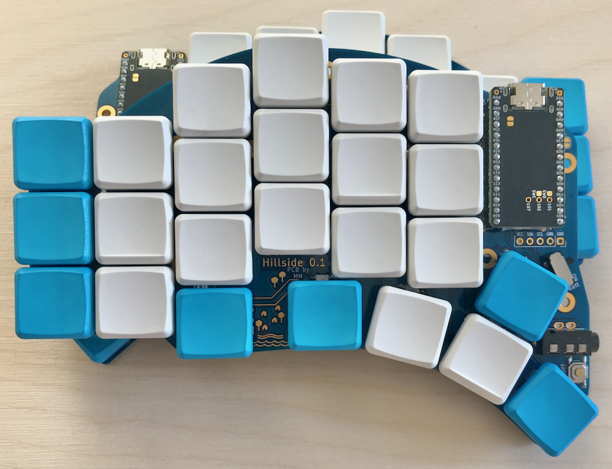
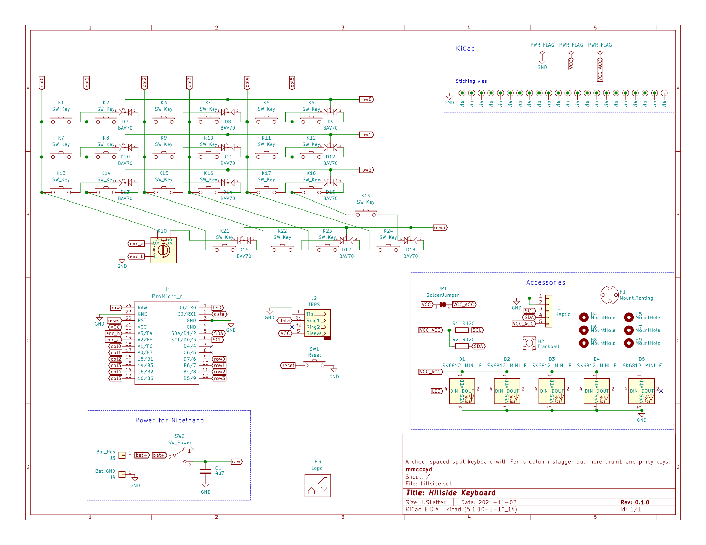
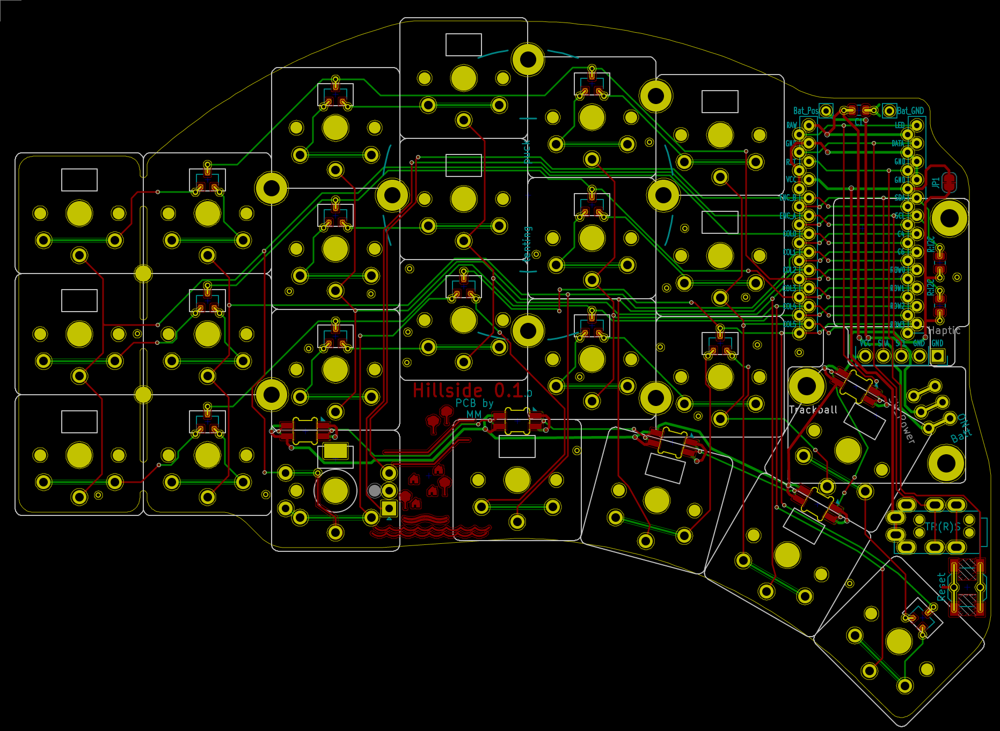
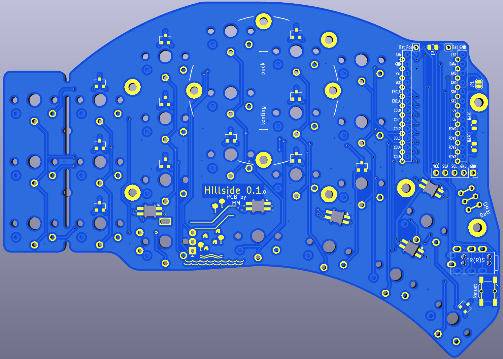

# Hillside Ergonomic Keyboard

Hillside is a split ergonomic keyboard with 3x6+4+2 choc-spaced keys. It has the aggressive stagger of the Ferris but a longer thumb arc and a break-off outer pinky column.

So rather like a choc Kyria, minus two keys. With 42 to 48 keys, it isn't minimalist,
  but it is compact on finger travel while still allowing roomy keymaps.

Features:
- 3x6+4+2 choc-spaced keys, aggressive stagger, four key thumb arc, break-off pinky column
- Tenting puck and trackball mount points
- QMK and ZMK firmware
- Nice!nano battery power switch and decoupling capacitor
- Encoder support under the ring fingers
- Haptic feedback header
- Underglow from five SK6812-MINI-Es
- Reversible 99 x 137mm PCB, which qualifies for AllPCB's free PCB offer
- Detailed BOM and default keyboard rationale.
- SMT diodes, resistors, capacitors, and reset switch

Hillside is _only_ suitable for choc v1 switches and keycaps based on an 18 x 17mm switch spacing, such as the MBK keycaps. Not MX ones, nor 18 x 18mm ones such as Work Louder.

## Hardware and Build Guide

See the [wiki](https://github.com/mmccoyd/hillside/wiki)
  for PCB ordering, parts links and a build guide with pictures.

See [Forking and Modifying](https://github.com/mmccoyd/hillside/wiki/Forking%20and%20Modifying)
  on whether it would be difficult to modify this design, for those that are interested.

## Firmware

QMK includes firmware for [Hillside](https://github.com/qmk/qmk_firmware/tree/master/keyboards/handwired/hillside).

For ZMK, firmware access is at [Hillside ZMK Firmware](https://github.com/mmccoyd/zmk-config).

The default keymap is shared by both and is described in QMK.

## Key Use
 
I expect most people will primarily use either the tucked three thumbs or the extended three (not counting the upper thumb). They can choose which part of the thumb arc best suits them. The most tucked thumb is also handy to reach with the middle finger, with the open space serving as a good reference. I find the upper thumb is best reached with the thumb. It needs care clearing the lower thumb but is still very handy. The keys outside of the primary three thumb keys are convenient for infrequent lock layers, escape, or for use when not actively typing for things such as mute.

# Why

I wanted choc spacing but a key or so more than the Ferris and an outer pinky column. Instead of tweaking the 3x6 choc Corne I started a new PCB for more flexibility, though it grew to fill its footprint...

The bottom row of my Atreus was useful for infrequent keys, so I added two keys under the middle columns, where they seemed unobtrusive. One of them then moved to the thumb arc, where it is more versatile. An upper thumb key seemed useful and combo-able without pushing the footprint. The result has more keys than my initial idea, but that makes keymap evolution feel less tight. 

It is like a Ferris Sweep on steroids, which wound up close to a Choc Kyria but requires board fabrication and SMT soldering.
Naming ideas included FeistyCorne, LongFir and LongSweep, but Hillside seemed the most fun.

## Acknowledgments

The excellent Low Profile Keyboards and splitkb.com discord communities provided a fertile learning ground for my keyboard explorations.
Several symbol and footprint files came from that community, as noted in the doc folder.
The keyboards I have used and read about also influenced this board, including the
  [Atreus](https://shop.keyboard.io/products/keyboardio-atreus),
  [Lily58](https://github.com/kata0510/Lily58),
  [Kyria](https://splitkb.com/collections/keyboard-kits/products/kyria-pcb-kit),
  [Corne](https://github.com/foostan/crkbd) and
  [Ferris](https://github.com/pierrechevalier83/ferris).

## Images

To test if the key layout suits your fingers,
 print these in landscape mode. 
  - Click on each to open the github file view. 
  - Click on raw to see just the file itself.
  - Tell your browser to print the file. But ensure it is at 100% and in landscape mode.
  
SVG files contain dimension information, so your browser should print it the correct size regardless of what size paper you are using.
As an extra check, the images each contain marked length lines, which you can check with a ruler.
The images are black lines on whatever the background is, so they do not like browser dark mode backgrounds, but will print black on white.

