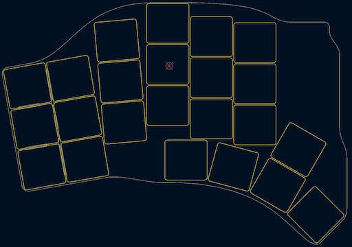

# Hillside 46 Ergonomic Keyboard

Hillside 46 is a split ergonomic keyboard with 3x6+5 choc-spaced keys.
It has the aggressive stagger of the Ferris plus
  finger splay, 
  a longer thumb arc and break-off outer pinky columns.

The column splay more naturally follows our hand's mechanics.
See the Hillside [family readme](../README.md) for features common to all hillside boards. Specific to the Hillside 46 are: 

* Two spots for one encoder per side at either: upper or tucked thumb or lowest ring
* Reversible 100 x 143mm PCB, which qualifies for AllPCB's free PCB offer
* Optional hotswap with Mill-Max switch sockets
* The top and bottom keys of the outer picky column can be removed individually or the whole column can be removed.

**This board is still a work in progress, though safe to build and use.**

The Hillside 46 is electrically the same as the Hillside 52, 
so the same firmware currently works for both. Just the keys in the physically missing row will never get pressed.

There are some cleanups I'll likely do prompted by the 52 board,
but the gerbers that KiCad will generate should be fine for manufacturing,
the changes from the 52 have been very simple.

**THIS IS AN INCOMPLETE README. Much of the below is still left over from the 52.**

Hillside includes:
 [QMK firmware](https://github.com/qmk/qmk_firmware/tree/master/keyboards/handwired/hillside) [PR](https://github.com/qmk/qmk_firmware/pull/17374) 
 with .json, .c, [via](https://github.com/mmccoyd/hillside/wiki/hill_46/via_config.json) and [vial](https://github.com/mmccoyd/vial-qmk/tree/hillside_46/keyboards/handwired/hillside/46/keymaps) keymaps,
 [ZMK Firmware](https://github.com/mmccoyd/zmk-config),
 a [keyboard layout editor](http://www.keyboard-layout-editor.com/) loadable [diagram](https://github.com/mmccoyd/hillside/wiki/hill_46/keyboard-layout-editor.json) 
 and a [draw.io](https://app.diagrams.net) loadable [diagram](https://github.com/mmccoyd/hillside/wiki/hill_46/drawio_keymap.png).

## Keymap

The default keymap alternate hand modifiers for all keys and a navigation and editing layer. See the [keymap descrition](https://github.com/mmccoyd/hillside/wiki/Hillside%2046%20Keymap) for details.

## Hardware and Build Guide

See the [wiki](https://github.com/mmccoyd/hillside/wiki)
  for PCB ordering, parts links and a build guide with pictures.

# Why

Your finger tips do not move parallel to each other when you curl and extend them. It makes sense that your keyboard should not either.

## Layout Tester
To test if the key layout suits your fingers,
 print these in landscape mode. 
 
  - Click on each to open the GitHub file view in a new tab. 
  - Click on raw to see just the file in the browser tab.
  - Tell your browser to print the file. But ensure it is at 100% and in landscape mode.
  
SVG files contain dimension information, so your browser should print it the correct size regardless of what size paper you are using.
As an extra check, the images each contain marked length lines, which you can check with a ruler.

The images are black lines on whatever the background is, so they do not like browser dark mode backgrounds, but will print black on white.

## Images

