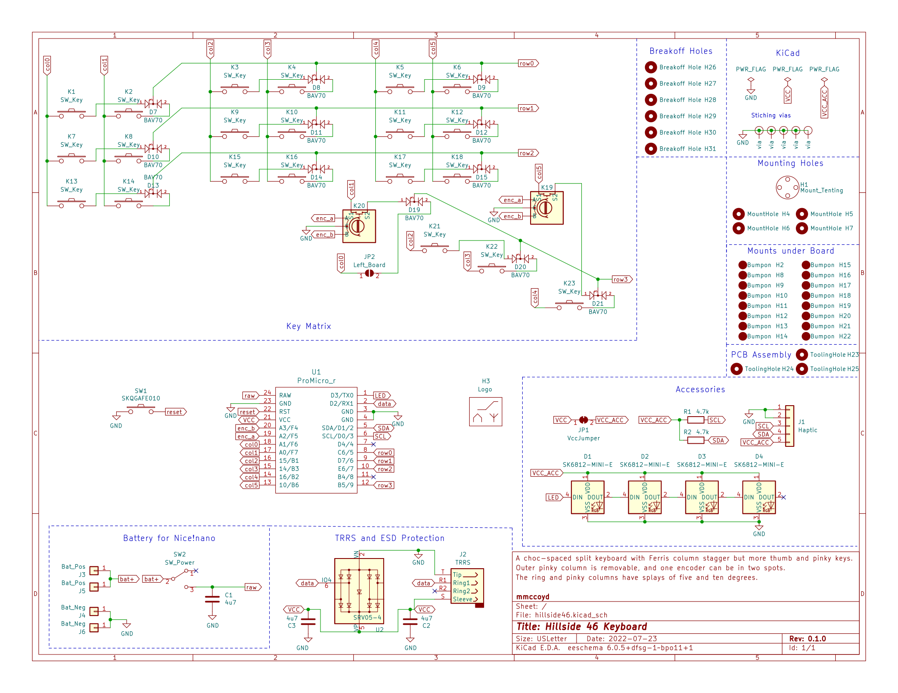
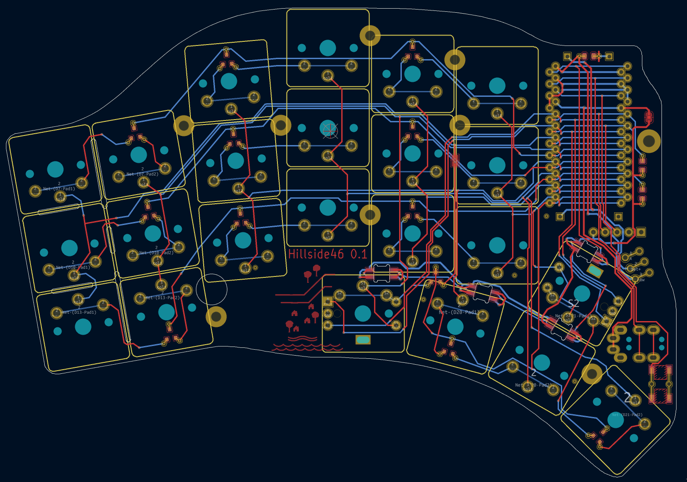
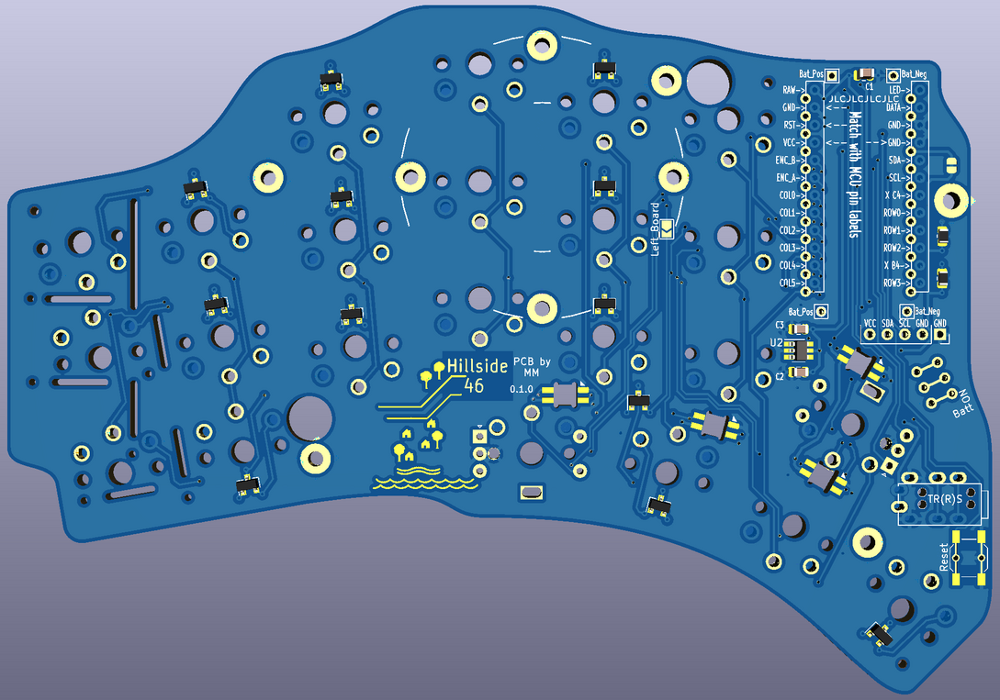

# Hillside 46 Ergonomic Keyboard

Hillside 46 is a split ergonomic keyboard with 3x6+5 choc-spaced keys.
It has the aggressive stagger of the Ferris plus
  finger splay,
  a longer thumb arc and break-off outer pinkie columns.

Splaying the columns lets our fingers more naturally follows our hand mechanics.
See the Hillside [family readme](../README.md) for features common to all hillside boards. Specific to the Hillside 46 are: 

* Optional factory parts soldering except for the switches, MCU, TRRS, LEDs and battery switch.
* Fab with PCBA is $9 per keyboard for five keyboards, plus shipping.  
  Or $12 each for two keyboards, if the diodes etc are on the left's top side and the right's bottom side.
* Encoder: Two spots for one per side at either: upper or tucked thumb
* Reversible 100 x 143mm PCB
* Optional hotswap with Mill-Max switch sockets (not part of PCBA)

Hillside includes:
 [QMK firmware](https://github.com/qmk/qmk_firmware/tree/master/keyboards/handwired/hillside) 
 with .json, .c, 
 [via](https://github.com/mmccoyd/hillside/wiki/hill_46/via_config.json) and 
 [vial](https://github.com/mmccoyd/vial-qmk/tree/hillside_46/keyboards/handwired/hillside/46/keymaps) keymaps,
 [ZMK Firmware](https://github.com/mmccoyd/zmk-config),
 a [keyboard layout editor](http://www.keyboard-layout-editor.com/) 
 loadable [diagram](https://github.com/mmccoyd/hillside/wiki/hill_46/keyboard-layout-editor.json)
 and a [draw.io](https://app.diagrams.net) 
 loadable [diagram](https://github.com/mmccoyd/hillside/wiki/hill_46/drawio_keymap.png).

## Keymap

The default keymap has a navigation and editing layer and alternate hand modifiers for all keys. See the [keymap descrition](https://github.com/mmccoyd/hillside/wiki/Hillside%2046%20Keymap) for details.

## Hardware and Build Guide

See [Ordering Hillside 46](https://github.com/mmccoyd/hillside/wiki/Ordering%20Hillside%2046) 
  for how to order
 and the [wiki](https://github.com/mmccoyd/hillside/wiki)
  generally for parts links and a build guide with pictures.

# Why

The splay is there because your finger tips do not move parallel to each other when you curl and extend them. It makes sense for your keyboard columns to match that.

## Layout Tester
To test if the key layout suits your fingers,
 print these in landscape mode. 
 
  - Click on each to open the GitHub file view in a new tab. 
  - Click on raw to see just the file in the browser tab.
  - Tell your browser to print the file. But ensure it is at 100% and in landscape mode.
  
SVG files contain dimension information, so your browser should print it the correct size regardless of what size paper you are using.
As an extra check, the images each contain marked length lines, which you can check with a ruler.

The images are black lines on whatever the background is, so they do not like browser dark mode backgrounds, but will print black on white.

|  |  |
|---|---|

## Images

 

