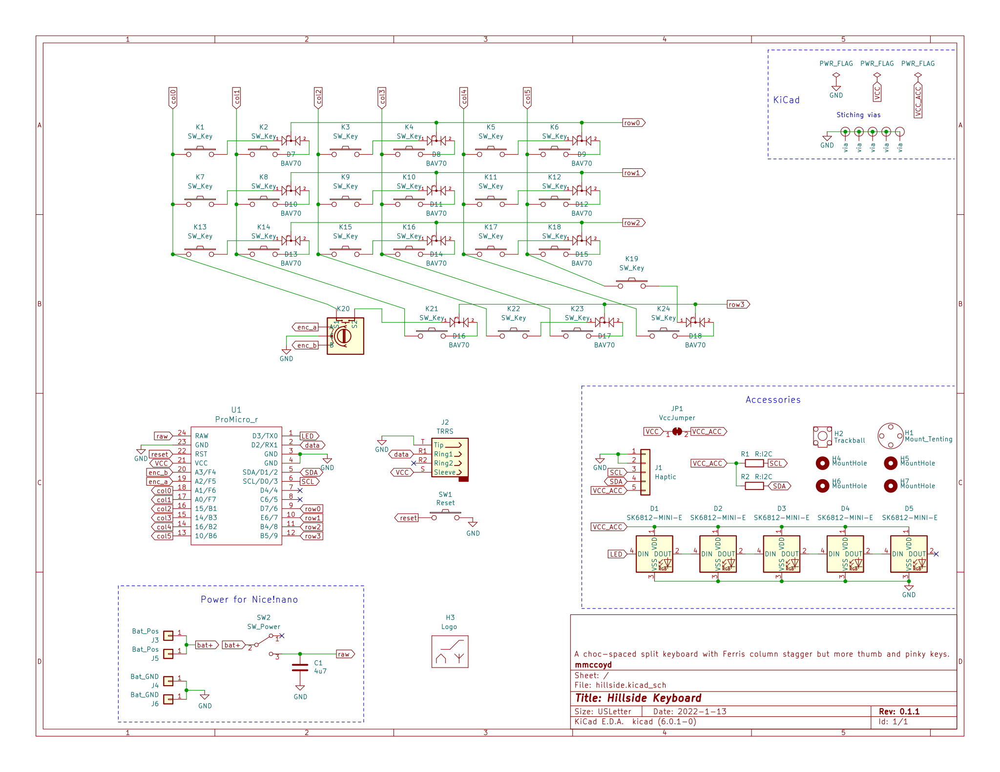
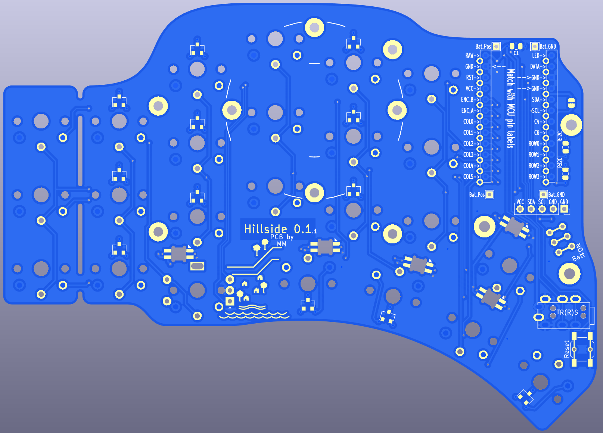

# Hillside 48 Ergonomic Keyboard


Hillside 48 is a split ergonomic keyboard with 3x6+1+5 choc-spaced keys. 
It has the aggressive stagger of the Ferris plus
  a longer thumb arc and break-off outer pinkie columns.

So rather like a choc Kyria, minus two keys. 
With 42 to 48 keys, it isn't minimalist,
  but it is compact on finger travel while still allowing roomy keymaps.
See the Hillside [family readme](../README.md) for features common to all hillside boards. Specific to the Hillside 48 are: 

* Encoder: One per side at the lowest ring finger key
* Reversible 99 x 137mm PCB

Hillside includes both 
 [QMK firmware](https://github.com/qmk/qmk_firmware/tree/master/keyboards/handwired/hillside)
 and [ZMK Firmware](https://github.com/mmccoyd/zmk-config).

## Keymap
The default keymap has numbers and symbols along the top layer rows for familiarity, alternate hand modifiers for all keys and a navigation and editing layer. See the [keymap descrition](https://github.com/qmk/qmk_firmware/tree/master/keyboards/handwired/hillside/48/keymaps/default) for details.

```
|  `    | Q | W | E | R | T |-------------------| Y | U | I | O | P | BKSPC |
| TAB   | A | S | D | F | G |-------------------| H | J | K | L | ; | ENTER |
| SHIFT | Z | X | C | V | B |ESC|-----------|CAP| N | M | , | . | / | SHIFT |
------------|CTR|---|GUI|ALT|Sym|SFT|---|Nav|SPC|ALT|GUI|---| ' |------------
```
```
| HOME  | ! | @ | # | $ | % |-------------------| ^ | & | * | ( | ) | DEL   |
| END   |GUI|ALT|CTR|SFT|INS|-------------------| [ | ] | - | = | \ | ENTER |
| SHIFT |   |VO-|MUT|VO+|PLY|OSM RALT|-----|MENU| { | } | _ | + | | | SHIFT |
------------|CTR|---|GUI|ALT|***|SFT|---|Adj|SPC|ALT|GUI|---|CTR|------------
```
```
| CUT   | 1 | 2 | 3 | 4 | 5 |-------------------| 6 | 7 | 8 | 9 | 0 | BKSPC |
| COPY  | <-|DN |UP |-> |PASTE|-----------------|PGU|SFT|CTR|ALT|GUI| PG_DN |
| SHIFT |F1 |F2 |F3 |F4 |F5 |UNDO|---------|REDO|F6 |F7 |F8 |F9 |F10| SHIFT |
------------|CTR|---|GUI|ALT|Adj|SFT|---|***|SPC|ALT|GUI| --|CTR|------------
```


## Hardware and Build Guide

See the [wiki](https://github.com/mmccoyd/hillside/wiki)
  for PCB ordering, parts links and a build guide with pictures.

# Why

I wanted choc spacing but a key or so more than the Ferris and an outer pinky column. Instead of tweaking the 3x6 choc Corne I started a new PCB for more flexibility, though it grew to fill its footprint...

The bottom row of my Atreus was useful for infrequent keys, so I added two keys under the middle columns, where they seemed unobtrusive. Then one of them moved to the thumb arc, where it is more versatile. An upper thumb key seemed useful and combo-able without pushing the footprint. The result has more keys than my initial idea, but that makes keymap evolution feel less tight. 

It is like a Ferris Sweep on steroids, which wound up close to a Choc Kyria but requires board fabrication and SMT soldering.
Naming ideas included FeistyCorne, LongFir and LongSweep, but Hillside seemed the most fun.


## Layout Tester

To test if the key layout suits your fingers,
 print these in landscape mode. 
 
  - Click on each to open the GitHub file view in a new tab. 
  - Click on raw to see just the file in the browser tab.
  - Tell your browser to print the file. But ensure it is at 100% and in landscape mode.
  
SVG files contain dimension information, so your browser should print it the correct size regardless of what size paper you are using.
As an extra check, the images each contain marked length lines, which you can check with a ruler.

The images are black lines on whatever the background is, so they do not like browser dark mode backgrounds, but will print black on white.

|  |  |
|---|---|


## Images

<div style="background-color:#DCDCDC;">


</div>




