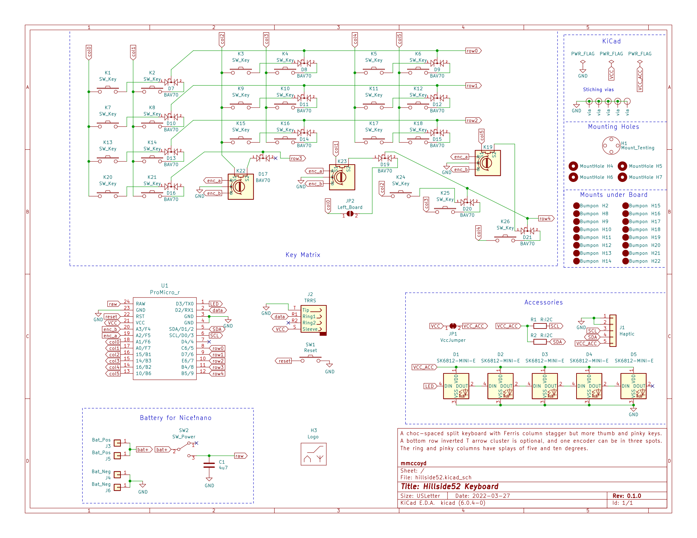
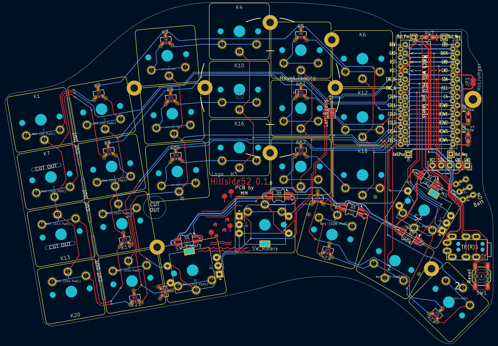
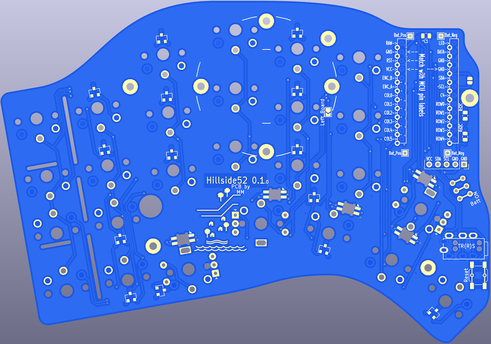

# Hillside 52

Hillside 52 is a split ergonomic keyboard with 3x6+3+5 choc-spaced keys.
It has the aggressive stagger of the Ferris plus
  finger splay, a physical arrow T, a longer thumb arc
  and break-off outer pinky columns.

The arrow clusters provide a more familiar keymap for users new to small keyboards and provide utility keys for more seasoned users. See the Hillside [family readme](../README.md) for features common to all hillside boards. Specific to the Hillside 52 are: 

* One Encoder per side at either: upper or tucked thumb or lowest ring
* Reversible 100 x 143mm PCB, which qualifies for AllPCB's free PCB offer

## Keymap

The default keymap has physical arrow keys, alternate hand modifiers for all keys and a navigation and editing layer. See the [keymap descrition](https://github.com/mmccoyd/hillside/wiki/Hillside%2052%20Keymap) for details.

## Firmware

QMK: a fork I need to push, which will become a PR

<!---

[Hillside58 fork](https://github.com/mmccoyd/qmk_firmware)
to be pushed and added as PR to QMK.
-->

ZMK: TBD

# Why

A visually easy to use keyboard is useful. Either for people new to small keyboards or for a keyboard pulled from a dusty drawer a year from now. The physical arrow cluster of a 65% keyboard makes it more intuitive than a 60% keyboard, so adding an arrow T to a 40% board seemed a way to make using a 40% board more obvious.

I find a few extra keys laying around lets me have multiple approaches to things. This allows me to choose between approaches gradually over time.
Also, the extra keys fit within the existing Hillside48 footprint and the inner arrow might be a good thumb key.

## Images

To test if the key layout suits your fingers,
 print the below switch layout images in landscape mode.
(The images do not show well on a dark nighttime background.)

