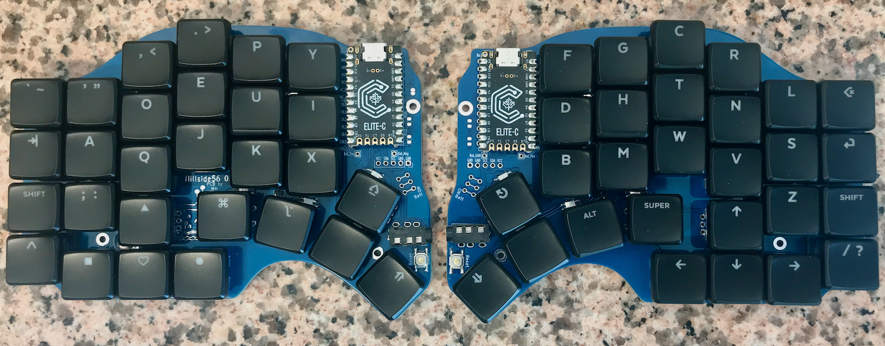
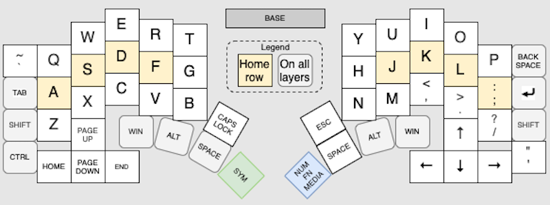
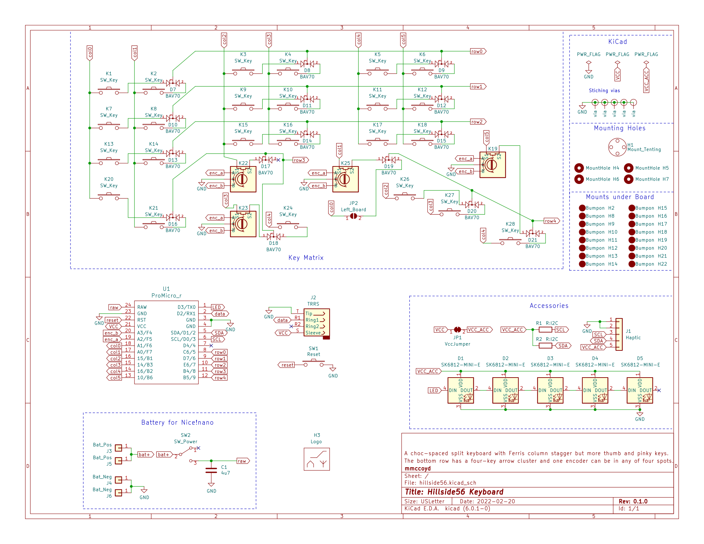
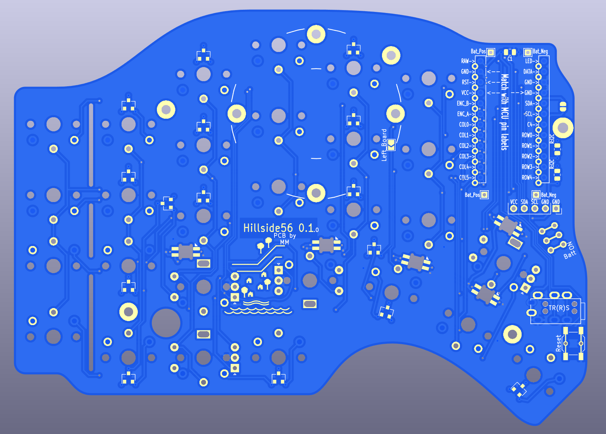

# Hillside56

Hillside56 is a split ergonomic keyboard with 3x6+5+5 choc-spaced keys.
It has the aggressive stagger of the Ferris but
  physical arrow clusters, a longer thumb arc,
  and a break-off outer pinky column.

The arrow clusters provide a more familiar keymap for users new to small keyboards and for more seasoned users provide good encoder or extra key spots.

Additional Features:
- Tenting puck mount point
- QMK and ZMK firmware
- Nice!nano battery power switch and decoupling capacitor
- One Encoder per side at either: upper or tucked thumb or two lowest ring
- Haptic feedback header
- Underglow from five SK6812-MINI-Es
- Reversible 100 x 138mm PCB, which qualifies for AllPCB's free PCB offer
- Detailed BOM and default keyboard rational.
- SMT diodes, resistors, capacitors, and reset switch

Hillside56 is _only_ suitable for choc v1 switches and keycaps based on an 18 x 17mm switch spacing, such as the MBK keycaps. Not MX ones, nor 18 x 18mm ones such as Work Louder.

## Hardware

See the [wiki](https://github.com/mmccoyd/hillside/wiki)
  for how to order the PCB and build the board.
The project files use KiCad 6.

See [Forking and Modifying](https://github.com/mmccoyd/hillside/wiki/Forking%20and%20Modifying)
  on whether it would be difficult to modify this design, for those that are interested.

## Firmware

QMK: a fork I need to push, which will become a PR

<!---

[Hillside58 fork](https://github.com/mmccoyd/qmk_firmware)
to be pushed and added as PR to QMK.
-->

ZMK: TBD

# Why

A visually easy to use keyboard is useful. Either for people new to small keyboards or for a keyboard I pull from a dusty drawer a year from now. The physical arrow cluster of a 65% keyboard makes it more intuitive than a 60% keyboard, so adding an arrow T to a 40% board seemed a way to make using a 40% board more obvious.

I find a few extra keys laying around lets me have multiple approaches to things. This allows me to choose between approaches gradually over time.
Also, the extra keys fit within the existing Hillside48 footprint, the inner arrow might be a good thumb key, and the center arrow seems a good encoder spot.

## Acknowledgments

The awesome Low Profile Keyboards and splitkb.com discord communities provided a fertile learning ground for my keyboard explorations.

## Images

To test if the key layout suits your fingers,
 print the below switch layout images in landscape mode.

